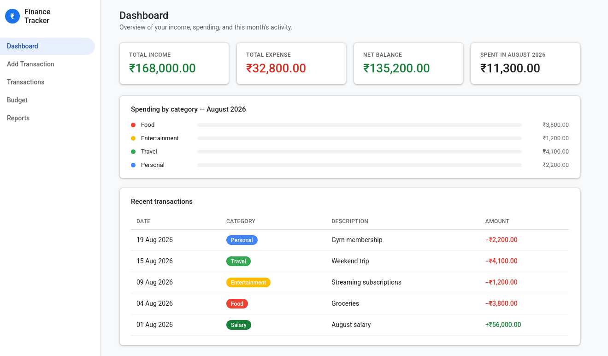
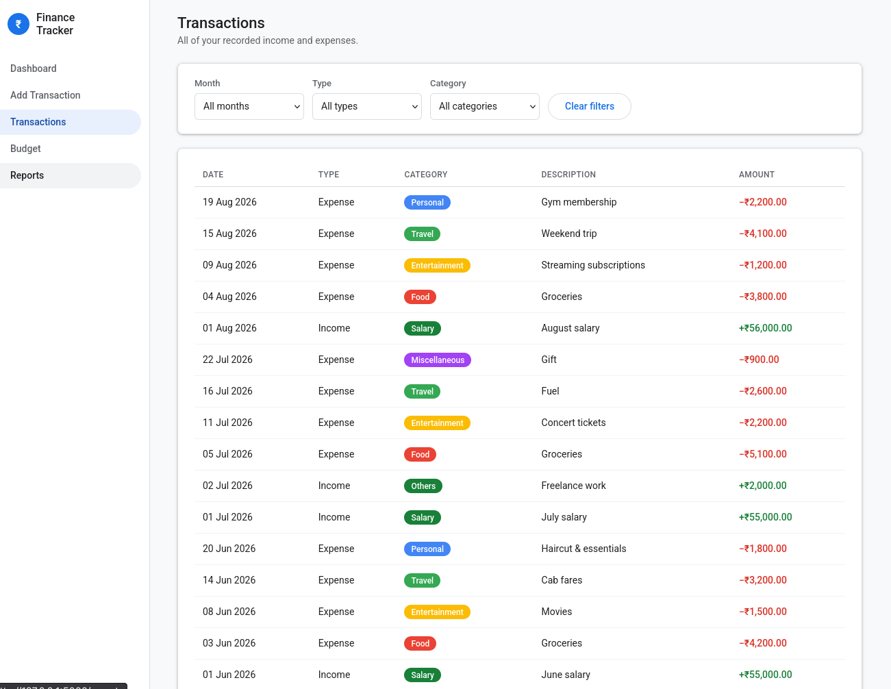
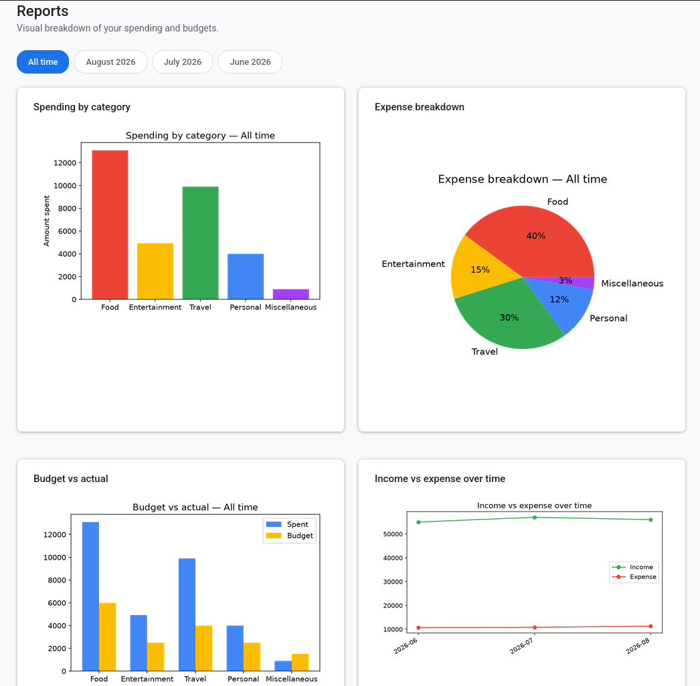

# Personal Finance Analyzer

A Python-based personal finance tracker with budget management and data
visualization — usable both as a command-line tool and through a Flask web
dashboard with a clickable HTML/CSS frontend.

## Screenshots

<p align="center">
  <br>
  <br>
  
</p>

## Features

- Transaction Management: Add income/expense transactions with categories (Food, Entertainment, Travel, Personal, Miscellaneous)
- Budget Tracking: Set monthly budgets per category with real-time overspending alerts
- Multiple View Options: View all transactions, filter by month, or date range
- Category Analysis: Filter and analyze spending by specific categories
- Summary Reports: Get detailed summaries for entire history or specific months
- Visual Analytics: Generate charts and graphs (bar charts, pie charts, line graphs) to visualize spending patterns
- Budget Comparison: Compare actual spending vs budgets with side-by-side visualizations
- Data Persistence: All data saved in JSON format for easy portability
- Web Dashboard: Flask + HTML/CSS frontend with Dashboard, Add Transaction,
  Transactions (with filters), Budget (set + track), and Reports (category,
  budget, and trend charts) pages

## Tech Stack

- Python 3
- Flask - Web frontend
- matplotlib - Data visualization
- JSON - File-based storage with datetime handling
- datetime - Date/time management

## Usage

### Command line

```
python main.py
```

### Web frontend

```
pip install -r requirements.txt
python app.py
```

Then open http://127.0.0.1:5000 in your browser.

On first run, the web app seeds a few months of sample transactions and a
budget under `data/` so the dashboard and charts aren't empty. Delete the
`data/` folder (or edit the JSON files) to start fresh — the sample data is
only there to make the first screenshots look good.

Data is stored locally in `data/transactions.json` and `data/budgets.json`.
This is a personal/local tool, not built for multi-user or production use.
